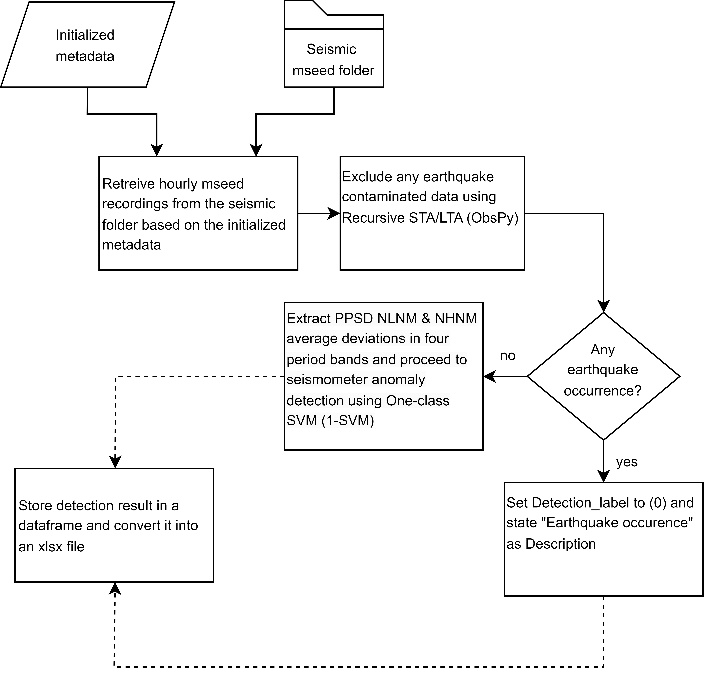

# Seismometer Anomaly Detection

This project is an implementation to the conference paper:
"A Design of Seismometer Anomaly Detection System Based on Frequency-domain Features"
Published in IEEE Xplore, 16 April 2025.
DOI:  10.1109/ISRITI64779.2024.10963616

For more details, refer to the published paper.


## 🔍 Overview



The system operates by:

1. **Connecting to a seismic mseed folder** using obspy.clients.filesystem.sds.  
2. **Excluding earthquake-contaminated data** using ObsPy's recursive STA-LTA.  
3. **Extracting Power Spectral Density (PSD) features** using PPSD from ObsPy at selected four periods ranges: 4-8s, 18-22s, 90-110s, and 200-500s.  
4. **Detecting anomalous seismometer data** using a One-class SVM (1-SVM) model.   
5. **Saving results** into a dataframe and converting it into an xlsx file.


## 🧠 Machine Learning Model

Pretrained model is included:

`model_1LSVM.pkl` — One-class SVM model for anomaly detection  


## 📦 Files in This Repo

| File                              | Description                                                   |
|-----------------------------------|---------------------------------------------------------------|
| `Seismometer_Anomaly Detection.py`| Main script to run anomaly detection on a specified duration  |
| `model_1SVM.pkl`                  | Pretrained 1-SVM model                                        |
| `NLNM_values.xlsx`                | PSD values of NLNM at selected four periods ranges            |
| `NHNM_values.xlsx`                | PSD values of NHNM at selected four periods ranges            |
| `requirements.txt`                | Python package dependencies                                   |
| `README.md`                       | This documentation                                            |
| `flowchart.png`                   | Flowchart image of this project                               |

> **Note:** seismic mseed files are **not included** in this repository due to data-sharing restrictions.  


# 📊 Output Dataframe

The system outputs a detection result dataframe with the following structure

**Example Data:**

| StationID   | Channel   | StartTime            | EndTime              | deviation features | EQ_label | Detection_label | Description            |
|-------------|-----------|----------------------|----------------------|--------------------|----------|-----------------|------------------------|
| ABC         | SHE       | 2025-04-10T21:00:00  | 2025-04-10T22:00:00  | ...                | -1       | 0               | Earthquake occurrence  |
| ABC         | SHN       | 2025-04-10T21:00:00  | 2025-04-10T22:00:00  | ...                | -1       | 0               | Earthquake occurrence  |
| ABC         | SHZ       | 2025-04-10T21:00:00  | 2025-04-10T22:00:00  | ...                | -1       | 0               | Earthquake occurrence  |
| ...         | ...       | ...                  | ...                  | ...                | ...      | ...             | ...                    |
| DEF         | SHE       | 2025-04-10T21:00:00  | 2025-04-10T22:00:00  | ...                | 1        | 1               | Normal data            |
| DEF         | SHN       | 2025-04-10T21:00:00  | 2025-04-10T22:00:00  | ...                | 1        | 1               | Normal data            |
| DEF         | SHZ       | 2025-04-10T21:00:00  | 2025-04-10T22:00:00  | ...                | 1        | 1               | Normal data            |
| ...         | ...       | ...                  | ...                  | ...                | ...      | ...             | ...                    |
| GHI         | SHE       | 2025-04-10T21:00:00  | 2025-04-10T22:00:00  | ...                | 1        | -1              | Anomalous data         |
| GHI         | SHN       | 2025-04-10T21:00:00  | 2025-04-10T22:00:00  | ...                | 1        | -1              | Anomalous data         |
| GHI         | SHZ       | 2025-04-10T21:00:00  | 2025-04-10T22:00:00  | ...                | 1        | -1              | Anomalous data         |

> **Note:** deviation features consist of NLNM and NHNM deviations at the four significant period bands.  


## 🚀 Usage
  
1. Make sure your Seismic mseed files are available in `C:\\Users\\Seismic Folder`.  
2. Run the diagnosis script:

```bash
python Seismometer_Anomaly Detection.py
```